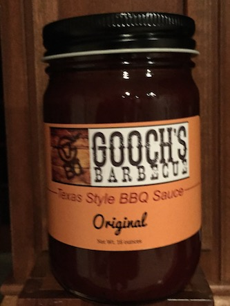

footer: © J. Scott Johnson, 2016 **www.fuzzyblog.io**
slidenumbers: true
# [fit] All You Need to Know About Pricing
---
# Learning This Cost Me $2,000

* The Bill N Story / 1994 
* Startup Tip: Get to Know Your Competitors!

---
# The Product - A Jar of Sauce

---

# Two Approaches Cost vs Value

---
# Cost Based Pricing

* Everything Costs you $5 per unit
* You want 50% margin
* You sell for $7.50
* Do this in a commodity business
* Startup Tip: You aren't a commodity!

---
# Value Based Pricing

* You charge for how people value it
* $7.50
* $10.00
* $12.00
* Whatever!
* Entrepreneurs ALWAYS underprice!!!! Always!

---
# How Do You Know What People will Pay?

* You ask
* A/B testing
* You get them to pay
* Throw up a web page and try and sell it
* Ask The Lisa!

---
# Closing Thoughts

* Always Use Value Based Pricing!
* Never, Ever Compete on Price
* You Aren't A Commodity
* Know Your Competitors - You Can Hire Them!

---